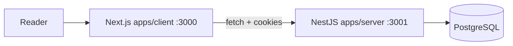

# Marginalia

**Marginalia** is a reading platform for exploring literary marginalia—curated entries tied to books and authors, with rich text passages and threaded reader comments. The name evokes the notes readers leave in the margins; here, each entry is a focused reading with metadata, cover art, and a space for discussion.

This repository is an npm **monorepo** containing a Next.js web app and a NestJS API backed by PostgreSQL.

| App | Path | Workspace | Default URL |
| --- | --- | --- | --- |
| **Web** | `apps/client` | `frontend` | http://localhost:3000 |
| **API** | `apps/server` | `server` | http://localhost:3001 |

Detailed documentation lives in each package:

- [Frontend (`apps/client`)](./apps/client/README.md) — routes, UI architecture, API client, theming
- [Backend (`apps/server`)](./apps/server/README.md) — REST API, database schema, auth, deployment config

---

## Table of contents

- [Features](#features)
- [How it works](#how-it-works)
- [Repository structure](#repository-structure)
- [Tech stack](#tech-stack)
- [Prerequisites](#prerequisites)
- [Getting started](#getting-started)
- [Scripts](#scripts)
- [Testing](#testing)
- [Configuration overview](#configuration-overview)

---

## Features

- **Browse entries** — Home page lists all marginalia with search by title, author, or book.
- **Read in depth** — Each entry shows cover, bibliographic metadata, and sanitized HTML content (Markdown-like input converted on the server).
- **Comment and reply** — Signed-in users post top-level comments and nested replies on an entry.
- **Accounts** — Register, log in, update profile, delete account. Sessions use JWTs in `httpOnly` cookies (and optional Bearer tokens).
- **Admin publishing** — Users with the `ADMIN` role create new entries from the web UI (floating action button + modal with a Markdown-aligned editor).

---

## How it works

The browser loads the Next.js app, which fetches data from the REST API. Authentication is cookie-based: the API sets a `token` cookie on login/register; the frontend sends it on every request with `credentials: 'include'`. CORS on the API allows the web origin with credentials enabled.



**Roles**

| Role | Typical use |
| --- | --- |
| `USER` | Read, comment, manage own profile |
| `ADMIN` | Everything above plus create/update/delete marginalia |

Role checks are enforced on the API; the frontend only hides or shows UI (e.g. the create button for admins).

---

## Repository structure

```
marginalia/
├── apps/
│   ├── client/          # Next.js 16 frontend (workspace: frontend)
│   └── server/          # NestJS 11 API (workspace: server)
├── packages/            # Reserved for shared packages (workspaces)
├── package.json         # Root scripts and workspaces
└── tsconfig.base.json   # Shared TypeScript base config
```

Each app is self-contained (own `package.json`, tests, and README). Install once at the root; npm workspaces link dependencies.

---

## Tech stack

| Area | Choices |
| --- | --- |
| **Monorepo** | npm workspaces, `concurrently` for local dev |
| **Frontend** | Next.js 16, React 19, Tailwind CSS 4, TypeScript, Vitest |
| **Backend** | NestJS 11, Prisma 7, PostgreSQL, Passport JWT, bcrypt |
| **API style** | REST JSON, `class-validator` on the server |
| **Content** | Markdown-like authoring → HTML + `sanitize-html` on the API |

---

## Prerequisites

- [Node.js](https://nodejs.org/) (LTS recommended)
- [npm](https://www.npmjs.com/)
- [Docker](https://www.docker.com/) (for local PostgreSQL via the server’s `compose.yml`)

---

## Getting started

### 1. Clone and install

```bash
git clone <repository-url>
cd marginalia
npm install
```

### 2. Configure the API

```bash
cd apps/server
cp .env.example .env
# Edit .env: DATABASE_URL, JWT_SECRET, DB_* as needed
docker compose up -d
npx prisma migrate deploy
npx prisma generate
cd ../..
```

See [apps/server/README.md](./apps/server/README.md#configuration) for all environment variables.

### 3. Configure the web app (optional)

```bash
# apps/client/.env.local
NEXT_PUBLIC_API_URL=http://localhost:3001
```

Defaults to `http://localhost:3001` if unset. See [apps/client/README.md](./apps/client/README.md#configuration).

### 4. Run both apps

From the repository root:

```bash
npm run dev
```

This starts:

- Frontend at **http://localhost:3000**
- API at **http://localhost:3001**

Run them separately if you prefer:

```bash
npm run dev:frontend   # Next.js only
npm run dev:server     # NestJS watch mode only
```

### 5. Create an admin (optional)

Register through the UI at `/register`, then promote the user to `ADMIN` in the database (e.g. via Prisma Studio or SQL) if you need to publish entries from the UI.

---

## Scripts

Run from the **repository root**:

| Script | Description |
| --- | --- |
| `npm run dev` | Start frontend and API together |
| `npm run dev:frontend` | Next.js dev server only |
| `npm run dev:server` | NestJS dev server only |
| `npm run build` | Build all workspaces |
| `npm run lint` | Lint all workspaces |
| `npm run test` | Run server unit tests, then frontend tests |
| `npm run test:server` | Jest (server) |
| `npm run test:frontend` | Vitest (client) |

Per-app scripts (`start`, `test:e2e`, coverage, etc.) are documented in the respective READMEs.

---

## Testing

| Package | Runner | Command (from root) |
| --- | --- | --- |
| `apps/server` | Jest | `npm run test:server` |
| `apps/server` e2e | Jest + Supertest | `npm run test:e2e --workspace server` |
| `apps/client` | Vitest | `npm run test:frontend` |

E2E tests for the API need a running PostgreSQL instance and a valid `apps/server/.env`. Details: [apps/server/test/README.md](./apps/server/test/README.md) and [apps/client/test/README.md](./apps/client/test/README.md).

---

## Configuration overview

| Concern | Location | Key variables |
| --- | --- | --- |
| Database | `apps/server/.env` | `DATABASE_URL`, `DB_USER`, `DB_PASSWORD`, `DB_NAME` |
| API port & auth | `apps/server/.env` | `PORT` (default **3001** in code), `JWT_SECRET` |
| API base URL (browser) | `apps/client/.env.local` | `NEXT_PUBLIC_API_URL` |
| CORS | `apps/server/src/main.ts` | Origin `http://localhost:3000` |

For production, point `NEXT_PUBLIC_API_URL` at your deployed API, update CORS origins, and use secure cookie settings appropriate for HTTPS.

---

## License

Private project (`private: true` in root `package.json`).
