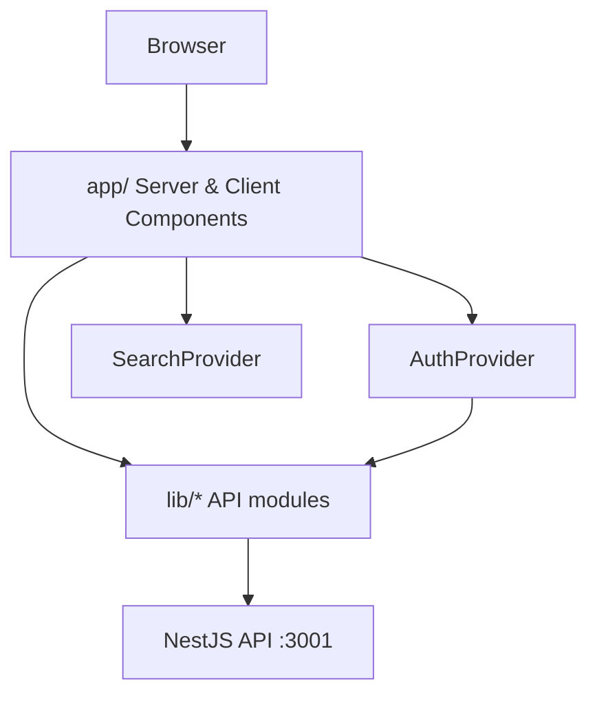

# Marginalia Web App

Next.js frontend for **Marginalia**—a reading platform where visitors browse literary marginalia entries, open individual readings with rich HTML content, search the catalog, and participate in threaded discussions. Authenticated users manage their profile; administrators publish new entries from the home page.

This app is the `frontend` workspace in the monorepo (`apps/client`) and talks to the NestJS API in [`apps/server`](../server/README.md).

Default URL in development: `http://localhost:3000` (see [Configuration](#configuration)).

---

## Table of contents

- [Introduction](#introduction)
- [Tech stack](#tech-stack)
- [Architecture](#architecture)
- [Project structure](#project-structure)
- [Routes and pages](#routes-and-pages)
- [API integration](#api-integration)
- [Data types](#data-types)
- [Authentication and roles](#authentication-and-roles)
- [Configuration](#configuration)
- [Getting started](#getting-started)
- [Scripts](#scripts)
- [Testing](#testing)
- [Styling and theming](#styling-and-theming)

---

## Introduction

The UI is built with the Next.js App Router. Most data is loaded on the server (home list, entry detail, comments) via `fetch` to the backend. Interactive flows—login, registration, comments, account settings, admin publishing—run in client components that call the same API with `credentials: 'include'` so JWT cookies issued by the server are sent automatically.

Key user flows:

- **Browse** — Home page lists all marginalia with client-side search (title, author, book).
- **Read** — `/marginalia/[id]` shows cover metadata, sanitized HTML body, and a nested comment tree.
- **Discuss** — Signed-in users post top-level comments and replies; the page refreshes after success.
- **Account** — Register, log in, update profile, delete account, log out.
- **Publish** — Users with role `ADMIN` see a floating action button and modal to create entries (Markdown editor aligned with server-side conversion).

---

## Tech stack

| Layer | Technology |
| --- | --- |
| Framework | [Next.js](https://nextjs.org/) 16 (App Router, Turbopack in dev) |
| UI library | React 19 |
| Language | TypeScript |
| Styling | Tailwind CSS 4 (`@import 'tailwindcss'`, CSS variables) |
| Fonts | `next/font` — Inter (UI), Libre Baskerville (display) |
| Icons | [lucide-react](https://lucide.dev/) |
| Images | `next/image` (remote HTTPS allowed via `next.config.ts`) |
| HTTP | Native `fetch` (no axios) |
| State | React Context (`AuthProvider`, `SearchProvider`) |
| Validation | Client helpers in `lib/validation.ts` (mirrors backend rules) |
| Tests | Vitest + Testing Library + jsdom |
| Monorepo | npm workspaces (`frontend` package name) |

`@marginalia/ui` is listed as a dependency for shared UI primitives; the app’s components live under `components/` today.

---

## Architecture

The codebase separates **routing** (`app/`), **presentation** (`components/`), **API clients** (`lib/*/api.ts`), **shared logic** (`lib/validation`, `lib/theme`, markdown helpers), **React context** (`providers/`), **hooks** (`hooks/`), and **TypeScript contracts** (`types/`).



### Rendering model

| Pattern | Where | Purpose |
| --- | --- | --- |
| **Server Components** | `app/page.tsx`, `app/marginalia/[slug]/page.tsx` | Initial data fetch, SEO-friendly HTML, error boundaries via `PageError` |
| **Client Components** | `'use client'` pages (`login`, `register`, `settings`), navbar, comments, modals | Forms, auth guards, `router.refresh()` after mutations |
| **Route groups** | `app/(auth)/`, `app/(user)/` | Organize auth/settings layouts without changing URLs |

### API client layer

- `lib/api/config.ts` — `API_BASE_URL` from `NEXT_PUBLIC_API_URL`.
- `lib/api/client.ts` — `handleJsonResponse`, `parseApiError`, `getErrorMessage`; dispatches `auth-expired` on 401.
- Domain modules — `lib/auth`, `lib/marginalia`, `lib/comments`, `lib/user` wrap endpoints with typed bodies and responses.

All authenticated requests use `credentials: 'include'` so the backend’s `httpOnly` `token` cookie is sent.

### Session handling

1. On mount, `AuthProvider` calls `GET /user` to restore the session.
2. Login/register update context from the response `user` object (cookie set by the server).
3. A 401 from protected API calls fires `window` event `auth-expired`; the provider clears the user.

Protected pages use `useRequireAuth()` (redirect to `/login`). Auth pages use `useRedirectIfAuth()` (redirect to `/` when already signed in).

---

## Project structure

```
apps/client/
├── app/                          # Next.js App Router
│   ├── layout.tsx                # Root layout, fonts, AuthProvider, Navbar, Footer
│   ├── page.tsx                  # Home — list + search
│   ├── globals.css               # Tailwind + light/dark theme tokens
│   ├── (auth)/
│   │   ├── login/page.tsx
│   │   └── register/page.tsx
│   ├── (user)/
│   │   └── settings/page.tsx
│   └── marginalia/[slug]/page.tsx  # Entry detail (slug = numeric id)
├── components/
│   ├── layout/                   # Navbar, Footer, HomeShell, ThemeScript
│   ├── marginalia/               # Card, List, CreateMarginaliaModal, MarkdownEditor
│   ├── comments/                 # Comment tree, CommentBox, ReplyBox
│   ├── search/                   # SearchBar
│   └── ui/                       # FormError, PageError, ThemeToggle
├── hooks/
│   ├── auth/                     # useRequireAuth, useRedirectIfAuth
│   └── marginalia/               # useCreateMarginalia
├── lib/
│   ├── api/                      # Shared fetch helpers + base URL
│   ├── auth/                     # login, register, logout, getCurrentUser, deleteAccount
│   ├── marginalia/               # CRUD fetch, form mapper, markdown editor utils
│   ├── comments/                 # getComments, postComment, replyComment
│   ├── user/                     # updateAccount
│   ├── validation.ts             # Form validation
│   └── theme.ts                  # Light/dark persistence
├── providers/
│   ├── auth-provider.tsx
│   └── search-provider.tsx
├── types/
│   ├── api/                      # User, Marginalia, Comment, auth bodies
│   ├── forms/                    # MarginaliaFormValues
│   └── ui/                       # CardProps, etc.
├── public/                       # Static assets
├── test/                         # Vitest setup, helpers, factories
├── next.config.ts
├── vitest.config.ts
└── postcss.config.mjs
```

---

## Routes and pages

Route groups `(auth)` and `(user)` do not appear in the URL.

| Route | File | Rendering | Description |
| --- | --- | --- | --- |
| `/` | `app/page.tsx` | Server + client children | Loads all marginalia; `SearchProvider` + `SearchBar` + `MarginaliaList`; `HomeShell` for admin FAB |
| `/marginalia/[slug]` | `app/marginalia/[slug]/page.tsx` | Server + client comments | Entry detail; `slug` is the marginalia **numeric id** |
| `/login` | `app/(auth)/login/page.tsx` | Client | Email/password login |
| `/register` | `app/(auth)/register/page.tsx` | Client | Account registration |
| `/settings` | `app/(user)/settings/page.tsx` | Client | Profile update and account deletion (`useRequireAuth`) |

### Layout

`app/layout.tsx` wraps every page with:

- Google fonts (Inter + Libre Baskerville)
- `ThemeScript` (inline script to apply stored theme before paint)
- `AuthProvider`
- Sticky `Navbar` (auth links, profile, logout, theme toggle)
- `Footer`

---

## API integration

Base URL: `NEXT_PUBLIC_API_URL` or `http://localhost:3001`.

The backend must run with CORS allowing `http://localhost:3000` and `credentials: true` (configured in the server’s `main.ts`). See the [server README](../server/README.md) for full endpoint documentation.

### Client functions → backend routes

| Module | Function | Method | Backend path |
| --- | --- | --- | --- |
| `lib/auth` | `getCurrentUser` | `GET` | `/user` |
| `lib/auth` | `login` | `POST` | `/auth/login` |
| `lib/auth` | `register` | `POST` | `/auth/register` |
| `lib/auth` | `logout` | `POST` | `/auth/logout` |
| `lib/auth` | `deleteAccount` | `DELETE` | `/user` |
| `lib/user` | `updateAccount` | `PATCH` | `/user` |
| `lib/marginalia` | `getAllMarginalias` | `GET` | `/marginalia/all` |
| `lib/marginalia` | `getMarginalia` | `GET` | `/marginalia/:id` |
| `lib/marginalia` | `createMarginalia` | `POST` | `/marginalia` |
| `lib/comments` | `getComments` | `GET` | `/comment/:id/comments` |
| `lib/comments` | `postComment` | `POST` | `/comment` |
| `lib/comments` | `replyComment` | `POST` | `/comment` (with `parentId`) |

After mutations that change server-rendered data (comments, new marginalia), components call `router.refresh()` to re-fetch Server Component props.

### Error handling

- API validation messages are parsed from JSON `{ message: string | string[] }`.
- `getErrorMessage(err, fallback)` normalizes unknown errors for UI display.
- `FormError` and `PageError` present messages to the user.

---

## Data types

TypeScript types in `types/api/` mirror API responses (passwords are never exposed).

### `User`

```ts
{ id: number; name: string; email: string; role: 'USER' | 'ADMIN' }
```

### `Marginalia`

```ts
{
  id: number
  userId: number
  title: string
  description: string
  cover: string      // HTTPS image URL
  book: string
  author: string
  contentEn: string  // Sanitized HTML from API
  createdAt: string
  updatedAt: string
  comments: Comment[]
}
```

### `Comment`

Flat or nested via `replies`:

```ts
{
  id: number
  content: string
  parentId: number | null
  userId: number
  marginaliaId: number
  createdAt: string
  updatedAt: string
  user?: { id: number; name: string }
  replies?: Comment[]
}
```

### Request bodies (client → API)

| Type | Fields |
| --- | --- |
| `LoginBody` | `email`, `password` |
| `RegisterBody` | `email`, `name`, `password` |
| `UpdateUserBody` | optional `name`, `email`, `password` |
| `CreateMarginaliaBody` | `title`, `book`, `author`, `description`, `cover`, `contentEn` |
| `CreateCommentBody` | `content`, `marginaliaId`, optional `parentId` |

`MarginaliaFormValues` in `types/forms/marginaliaForm.ts` backs the admin create modal; `toCreateMarginaliaBody()` maps it to `CreateMarginaliaBody`.

---

## Authentication and roles

| Role | UI behavior |
| --- | --- |
| **Guest** | Browse home and entries; read comments; navbar shows Log In / Sign Up |
| **USER** | Post comments and replies; access `/settings`; profile menu in navbar |
| **ADMIN** | All `USER` abilities plus floating **create** button on home and `CreateMarginaliaModal` (calls `POST /marginalia`) |

Role checks are client-side for UX only (`user?.role === 'ADMIN'` in `HomeShell`). The API enforces authorization on the server.

### Auth hooks

| Hook | Behavior |
| --- | --- |
| `useRequireAuth()` | Redirect to `/login` if `user` is null |
| `useRedirectIfAuth()` | Redirect to `/` if `user` is set (login/register pages) |

---

## Configuration

### Environment variables

Create `apps/client/.env.local` (not committed):

| Variable | Required | Default | Description |
| --- | --- | --- | --- |
| `NEXT_PUBLIC_API_URL` | No | `http://localhost:3001` | Backend base URL (exposed to the browser) |

Example:

```env
NEXT_PUBLIC_API_URL=http://localhost:3001
```

### `next.config.ts`

- `images.remotePatterns` — allows any `https://**` host for marginalia cover URLs.
- `experimental.optimizePackageImports` — tree-shakes `lucide-react`.

### Path alias

`@/*` maps to the `apps/client` root (see `tsconfig.json`).

---

## Getting started

**Prerequisites:** Node.js, npm, running [Marginalia API](../server/README.md) (PostgreSQL + migrations).

1. Install dependencies from the monorepo root:

   ```bash
   npm install
   ```

2. Configure the API URL (optional if using defaults):

   ```bash
   cd apps/client
   # create .env.local with NEXT_PUBLIC_API_URL=http://localhost:3001
   ```

3. Start the backend (from `apps/server` or root `npm run dev:server`).

4. Start the frontend:

   ```bash
   npm run dev
   ```

   Or from the repository root:

   ```bash
   npm run dev:frontend
   ```

5. Open [http://localhost:3000](http://localhost:3000).

To run both apps together from the root:

```bash
npm run dev
```

---

## Scripts

Run from `apps/client/` unless noted.

| Command | Description |
| --- | --- |
| `npm run dev` | Next.js dev server (Turbopack) |
| `npm run build` | Production build |
| `npm run start` | Serve production build |
| `npm run lint` | ESLint (Next.js config) |
| `npm run test` | Vitest — run all tests once |
| `npm run test:watch` | Vitest watch mode |
| `npm run test:cov` | Vitest with coverage |

Production:

```bash
npm run build
npm run start
```

---

## Testing

See [`test/README.md`](test/README.md).

**Commands:** `npm test`, `npm run test:watch`, `npm run test:cov`

**Layout**

- `test/setup.tsx` — global mocks (`next/image`, `next/navigation`)
- `test/helpers/` — `render` wrapper, factories for user/marginalia
- Co-located `*.spec.ts` / `*.spec.tsx` next to source

**Coverage highlights**

| Layer | Examples |
| --- | --- |
| `lib/` | validation, API client, markdown editor, theme |
| API modules | auth, marginalia, comments, user (`fetch` mocked) |
| Providers / hooks | `AuthProvider`, `SearchProvider`, `useCreateMarginalia` |
| Components | `FormError`, `MarginaliaCard` |

---

## Styling and theming

### Tailwind CSS 4

`app/globals.css` defines semantic tokens:

- `--background`, `--foreground`, `--default`, `--default-foreground`
- Applied via `.light` / `.dark` on `<html>`

`@theme` maps tokens to Tailwind utilities (`bg-background`, `text-default`, `font-display`, etc.).

### Theme toggle

- `lib/theme.ts` — read/write `localStorage` key `theme` (`light` | `dark`, default `light`).
- `ThemeScript` in layout prevents flash of wrong theme on first paint.
- `ThemeToggle` in the navbar switches classes on `document.documentElement`.

### Markdown editor (admin)

`components/marginalia/markdown-editor.tsx` uses helpers from `lib/marginalia/markdown-editor.ts` (`MARKDOWN_WRAP`, `MARKDOWN_BLOCK`) that match the server’s `markdownToHtml` rules (bold, italic, lists, links, images, blockquotes, etc.), so preview and stored HTML stay consistent.

---

## License

Private package (`private: true` in `package.json`).
